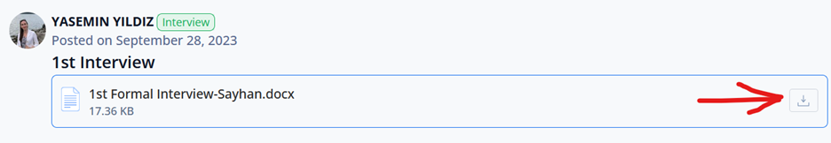
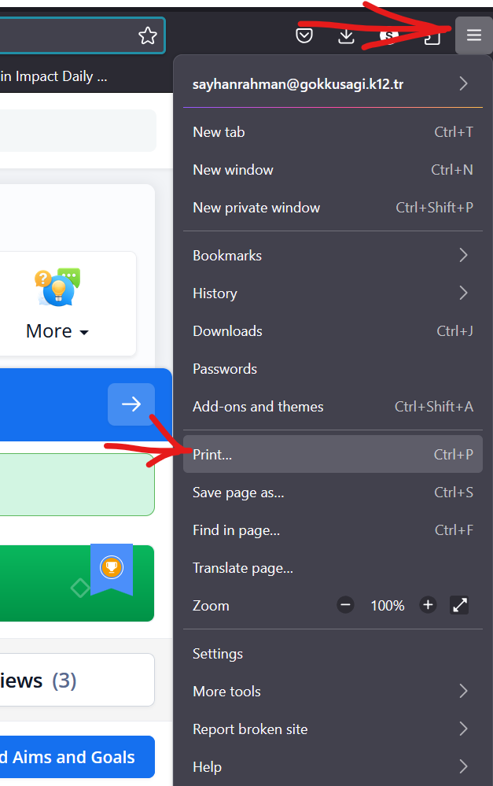
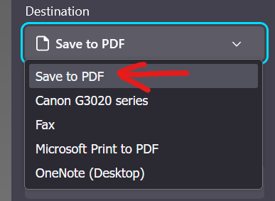
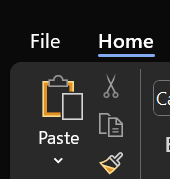
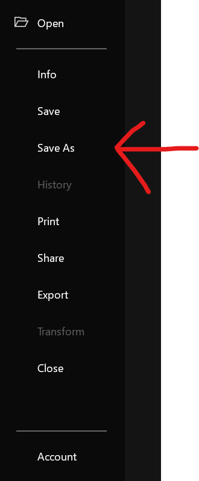
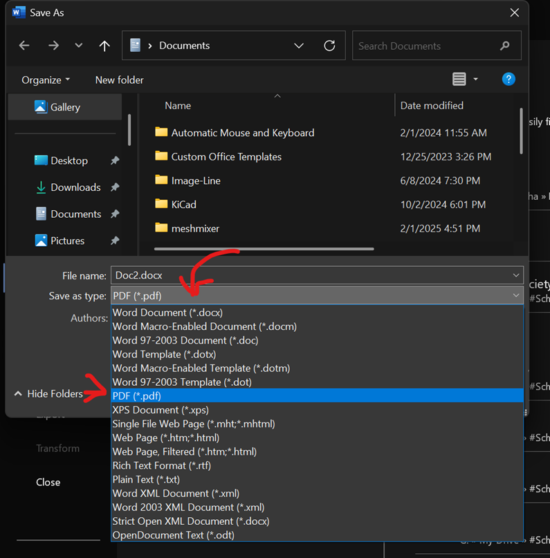

# How to Complete the Final CAS Requirements (Downloading and printing the files)

## Table of Contents

- [Downloading the Files](#downloading-the-files)
- [Printing the Documents](#printing-the-documents)
- [FAQ](#faq)

## Downloading the Files

### 1. Downloading the Interviews

Let's deal with the easy ones first:

- Use a **laptop or computer** (preferred over phones or tablets) and head to [ManageBac CAS](https://gokkusagi.managebac.com/student/ib/activity/cas).
- Sign in if necessary, then click on **[Notes and Interviews](https://gokkusagi.managebac.com/student/ib/activity/notes)**.
- Scroll down to find your interviews, and click **Download**.

- Repeat the same steps for the other two interviews.
- This will download the interviews as **MS Word (.docx) files**.

### 2. Downloading CAS Completion Forms

- Head to the **[Documents](https://gokkusagi.managebac.com/student/ib/activity/documents)** page on ManageBac.
- Follow the same downloading steps as above.
- This will download the **CAS Completion Form as PDF files** for all your CAS experiences.

### 3. Downloading Your CAS Homepage

- Navigate to your **[CAS homepage](https://gokkusagi.managebac.com/student/ib/activity/cas)**, which shows all your experiences as a list, along with progress & learning outcomes.
- Press **Ctrl+P** (Windows) or **Cmd+P** (Mac) to open the print dialog.
- Alternatively, click on the three dots on the top right of your browser. Then click on Print.
  
- In the print settings:
  - **Select Destination:** "Save to PDF".
    - 
  - **Orientation:** Portrait (best results).
  - **Paper Size:** A4.
  - **Scale:** 100% or "Fit to Page Width".
  - **Margins:** Keep default settings.
  - **Check the box:** "Print headers and footers" to avoid page cuts.

### 4. Converting Word Files to PDF

- Locate the downloaded **.docx** files.
- Open them and click **File > Save As**.
  - 
  - 
- Choose a **suitable location**, and save the file as **PDF**.
  - 

## Organizing and Printing

- **Place all the files in a single folder** for efficiency.
- You can either:
  - Print all files **at home** one by one.
  - Copy them to a **USB Flash Drive** to print from a **local store** or **school printer**.

### Good Luck! 🎉

## FAQ

**Q: What if my files are not downloading correctly?**  
A: Ensure you are signed in to ManageBac. Try using a different browser or clearing your cache.

**Q: My PDF print preview is cutting off some content, what should I do?**  
A: Make sure you selected **"Fit to Page Width"** and **checked the "Print headers and footers"** option.

**Q: Can I print double-sided?**  
A: Yes, if your printer supports duplex printing, it's recommended to save paper!

**Q: I can’t find my CAS homepage, where do I look?**  
A: Your CAS homepage is located in the "Coordinator" tab in ManageBac Home. If you can't find it, click [here](https://gokkusagi.managebac.com/student/ib/activity/cas).

**Q: My PDF files are too large to upload or email, what can I do?**  
A: Use an online PDF compressor like Smallpdf or Adobe Acrobat to reduce the file size.

**Q: Do I need to print everything in color?**  
A: No, black and white prints are usually acceptable.

**Q: My printer isn’t working, what are my options?**  
A: You can print at a local print shop, a school printer, or a library.

**Q: Can I submit my CAS documents digitally instead of printing?**  
A: Ms. Yasmine requires both the digital copies and the physical copies, so no unfortunately.

---

I put this together to make everyone’s life easier—even though I didn’t have to. Because at the end of the day, we all just want to get through CAS without losing our minds. Hope this helps! If you run into issues, ask our CAS coordinator or me :\)
